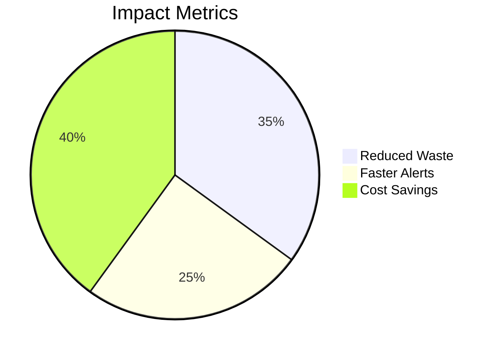
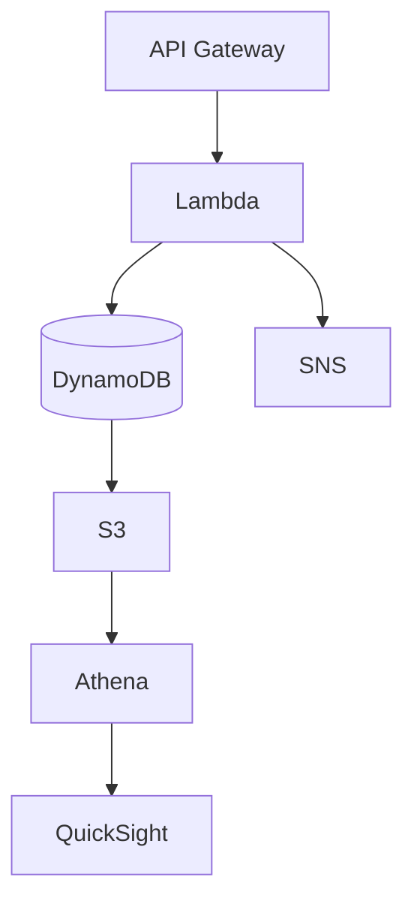

```markdown
# 🏥 AI-Driven Medicine Inventory Optimization �💊


> **An AWS serverless system that reduces medical waste by 30-40% through real-time tracking and predictive analytics**

---

## 🌟 Key Features
| Category | Implementation |
|----------|----------------|
| **Real-time Tracking** | Lambda + DynamoDB processing |
| **Predictive Alerts** | Configurable SNS notifications |
| **Cost Dashboard** | QuickSight analytics |



---

## 🛠️ Tech Stack


---

## 🚀 Quick Start
```bash
git clone https://github.com/YOUR-USERNAME/YOUR-REPO.git
cd YOUR-REPO
terraform init
terraform apply
```

---

## 📜 License
MIT - See [LICENSE](LICENSE) for details.
```