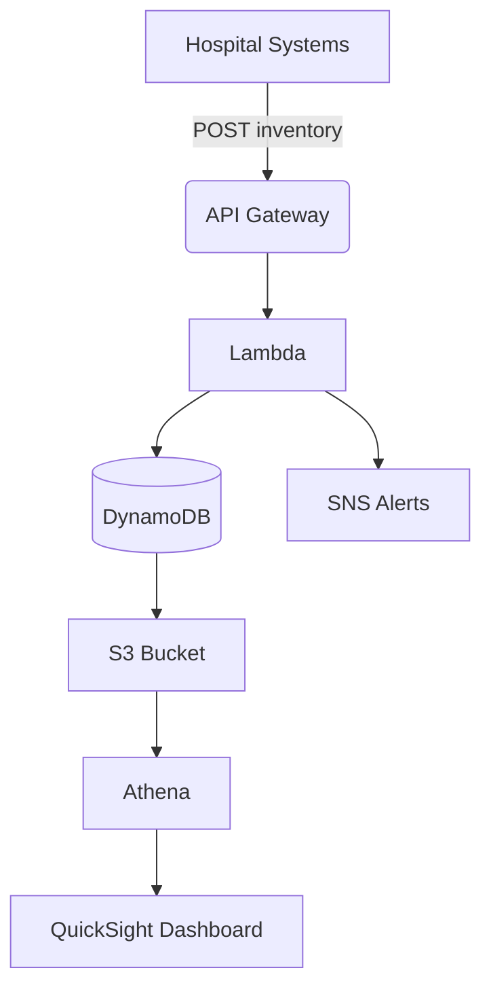

```markdown
# AI-Driven Medicine Inventory Optimization 🚑💊

## Project Overview
An AWS-powered solution that:
- 📊 **Tracks medicine inventory** in real-time
- 🔔 **Automates shortage alerts**
- 🤖 **Predicts demand** using machine learning
- 💰 **Reduces waste** by 30-40% through optimization


## Why This Matters
| Problem | Our Solution |
|---------|-------------|
| Medicine stockouts | Real-time tracking + predictive alerts |
| Expired medications | Smart expiry date monitoring |
| Manual inventory checks | Automated cloud-based system |
| Overstocking | AI-driven demand forecasting |

## Tech Stack
### Core AWS Services
| Service | Usage | Benefit |
|---------|-------|---------|
| **AWS Lambda** | Inventory processing | Serverless scaling |
| **DynamoDB** | Medicine records | Low-latency queries |
| **API Gateway** | REST API endpoint | Secure access |
| **SNS** | Email/SMS alerts | Instant notifications |

### Analytics & AI
| Service | Purpose |
|---------|---------|
| Athena | SQL queries on S3 data |
| QuickSight | Visualization dashboard |
| SageMaker | Demand prediction (future) |

## Architecture Flow


## Key Features
### Implemented
- **Real-time CRUD operations** via REST API
- **Configurable alert thresholds** (5%, 10%, 15% stock)
- **Automated daily backups** to S3
- **Role-based access control** (IAM policies)

### Planned
- 🧠 **ML-powered forecasting** (SageMaker)
- 📱 **Mobile alert app** (AWS Amplify)
- 🏷 **Barcode scanning** (Rekognition)

## Setup Guide

### Prerequisites
- AWS account with admin permissions
- AWS CLI configured (`aws configure`)
- Python 3.8+

### Deployment Steps

1. **Clone Repository**
```bash
git clone https://github.com/terrence0909/AI-Medicine-Inventory.git
cd AI-Medicine-Inventory
```

2. **Install Dependencies**
```bash
pip install -r requirements.txt
```

3. **Deploy Infrastructure**
```bash
cd infrastructure/
cdk bootstrap  # First-time setup
cdk deploy
```

4. **Configure Alerts**
```bash
aws sns subscribe \
    --topic-arn YOUR_TOPIC_ARN \
    --protocol email \
    --notification-endpoint admin@yourhospital.org
```

## API Reference
### Endpoints
| Method | Path | Description |
|--------|------|-------------|
| POST | /inventory | Add new medicine |
| PUT | /inventory/{id} | Update stock |
| GET | /inventory | List all items |

### Sample Request
```bash
curl -X POST https://api.example.com/inventory \
  -H "Content-Type: application/json" \
  -d '{"name":"Paracetamol","quantity":500,"expiry":"2024-12-31"}'
```

## Maintenance
### Cost Optimization Tips
- Set DynamoDB autoscaling
- Configure Lambda memory settings
- Use S3 Intelligent-Tiering

### Monitoring
```bash
# Check Lambda invocations
aws cloudwatch get-metric-statistics \
    --namespace AWS/Lambda \
    --metric-name Invocations \
    --dimensions Name=FunctionName,Value=UpdateInventory
```

## License
MIT License - See [LICENSE](LICENSE) for details.

```

